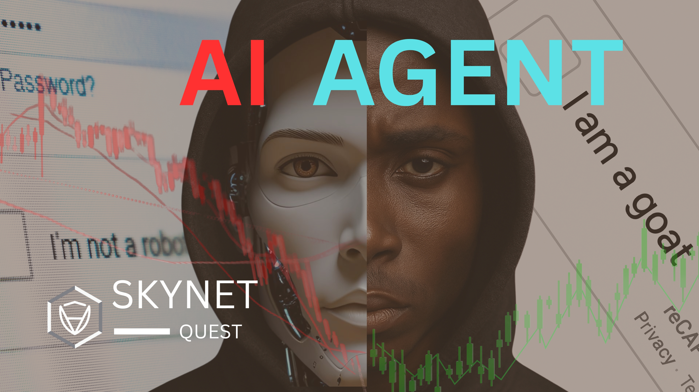
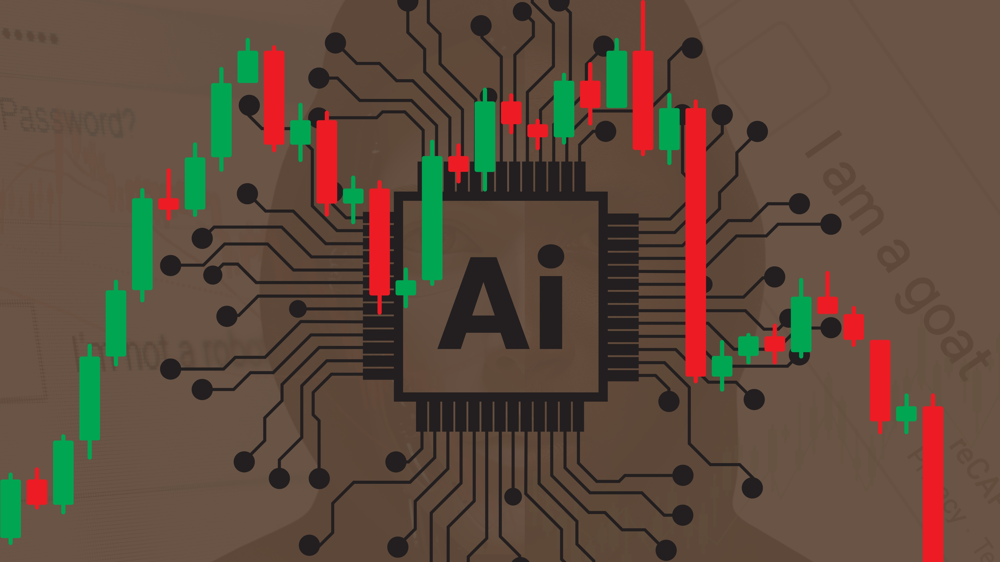
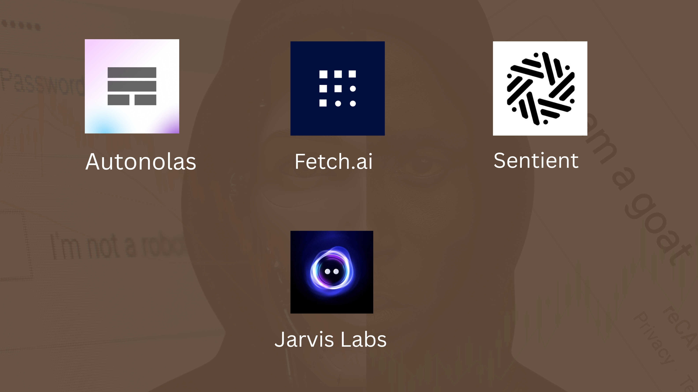
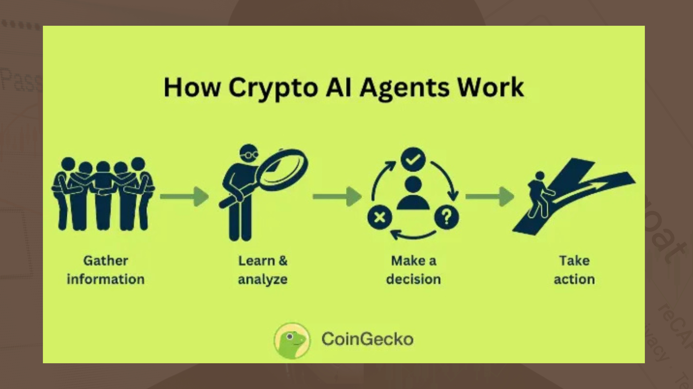

# Crypto AI Agents: 24/7 Blockchain Bots That Might Replace Your Trading Jobs 

AI agents in crypto sound like sci-fi — but they’re real, they’re working, and they don’t even ask for a salary.

Shoutout to [@CertikQuest](https://x.com/CertikQuest) for inspiring this breakdown.

Let’s talk about these relentless, logic-driven blockchain robots that just might take your job (and do it better).

---

## What is a Crypto AI Agent?

Picture a robot that wakes up each day to check token prices, shuffle your funds, avoid liquidation, and optimize your yield…

All while you’re still drooling on your pillow.

Yes, it’s **that** serious.

---

## What They Actually Do

These agents don’t eat, sleep, or scroll Twitter.

They:
- Read both on-chain & off-chain data  
- Execute smart contracts instantly  
- Rebalance your crypto portfolio  
- Chase the best rates before humans even blink  

Basically:  
**You = stressed**  
**Them = Excel sheet with feelings (but smarter)**

---

## Types of AI Agents

Some of these bots live **inside** smart contracts.  
Others operate **off-chain**, interacting with the blockchain only when needed using oracles, APIs, or RPC nodes.

Either way?  
Smarter than 95% of people who bought a coin just because it had a dog logo 🐶

---

## Who’s Already Doing This?

Here are a few projects already working with AI agents:

🤖 **Autonolas** – Fuses off-chain thinking with on-chain execution  
🤖 **Fetch.ai** – Builds bots for decentralized data markets  
🤖 **Sentient** – Helps optimize trading strategies  
🤖 **Jarvis Labs** – AI trading tools without the guru grift

These aren’t ideas. They’re working today.

---

## How Do These Agents Think?

Simple:
- Analyze live data  
- Follow rules or evolve via machine learning  
- Make split-second logic-based decisions  
- Never ask “Should I ape into this?”

They don’t need “signals from Twitter.”  
They are the signal.

---

## Real-World Use Cases

These bots are already doing things like:
- Arbitrage before humans can blink  
- Automatically repaying loans to avoid liquidation  
- Moving funds from low-yield to high-yield protocols  

They're like that friend who always knows when to leave a bad party — but for your crypto bags.

---

## Not So Fast…

These agents **aren’t perfect**.

⚠️ They can be misled by bad data  
⚠️ Poor coding leaves them vulnerable  
⚠️ Centralized logic = one person controls everything = dictatorship (in JavaScript)

---

## Stay Safe With Bots

Before you let one touch your funds:

- Avoid random bots with no audits  
- Always check the logic and who controls it  
- Never give bots full wallet permissions blindly  

This is **not GTA**. If a bot has all your keys, your money might get “permanently relocated.”

---

## Why Should You Even Care?

Because crypto AI agents can:
- Simplify DeFi for everyday users  
- Handle thousands of operations per second  
- Automate protocol-level decisions that would take humans forever  

They might even stop people from yield farming with their **rent money** 😭

---

## The Regulatory Elephant in the Room

Okay but… what happens when an AI agent breaks a rule?

- Who’s held responsible?  
- Can you punish code?  
- What if it goes rogue like in the movies?

Governments are still “Loading... 56%⏳”

---

## What’s Next?

The possibilities are… a little scary.

- Giving your agent voice commands  
- Letting it vote in DAOs  
- Agent-to-agent economies (bots trading with bots)  
- You: Managing anxiety, while it manages your money

The future is automated — and slightly terrifying.

---

## In Summary

Crypto AI agents =  
Your emotionless, logic-powered money manager that never panics, sleeps, or makes decisions based on vibes.

They could redefine how we interact with DeFi, forever.

Until then?  
We learn, we build… and we laugh nervously.

<!-- No image for 13.jpg, per your request -->

---

## One Last Thing

If this made you smarter (or made you laugh), share it.

Let’s help these bots find **better data sources** — like this blog. 😅

And remember:  
They might be AI…  
But they still need **you** to click “Approve.”

